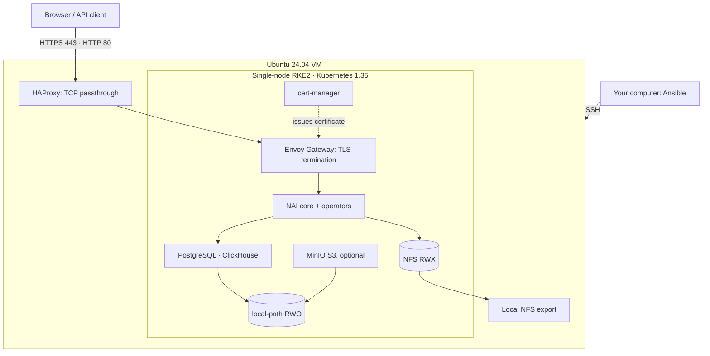

# Nutanix Enterprise AI 2.8 PoC installer

[](https://github.com/marco-fabbri/nutanix-enterprise-ai-poc/actions/workflows/ci.yml)


One Ansible playbook that turns an existing **Ubuntu 24.04 VM** into a
**single-node Nutanix Enterprise AI (NAI) 2.8 proof of concept**: Kubernetes
(RKE2), storage, the operators NAI depends on, NAI itself and HTTPS access.
Nothing in this repository talks to a hypervisor. The VM can live on Nutanix
AHV, VMware, KVM, a public cloud or a workstation, as long as SSH reaches it.

**What this is not.** It is not a highly available or vendor-supported
production design, and it does not deploy GPU workers or models. Check
Kubernetes conformance and version compatibility against the NAI
documentation for your release; this project does not certify support for the
configuration it builds.

**Who this is for.** The NAI container images are private: you need a
Docker Hub account that Nutanix has authorized for them, which comes with an
NAI entitlement (customer, partner or trial). Without it the installation
stops at the first image pull. Everything else the installer needs is public.

## Architecture



Everything runs on the one VM. The Envoy Gateway service has no cloud load
balancer, so HAProxy on the VM forwards TCP 80 and 443 to it; TLS is still
terminated by Envoy with the NAI certificate. Persistent data stays on the VM
disk through local-path (RWO) and a local NFS export (RWX). MinIO is an
optional S3 service for importing models from a bucket, in place of Nutanix
Objects.

## VM requirements

| Requirement | PoC baseline |
|---|---|
| Operating system | Ubuntu Server 24.04 LTS, x86-64 (the installer refuses anything else unless `nai_skip_os_check=true`) |
| CPU / memory | 16 vCPU, 48 GiB dedicated RAM, no memory overcommit |
| Disk | 150 GiB SSD on the root filesystem |
| Network | Static IPv4, outbound Internet access, ports 80 and 443 free |
| Access | An account with SSH key login and passwordless sudo |
| State | Fresh VM: no Kubernetes, Docker or other services already installed |

The sizing is the lab allocation this project was built with, not a vendor
figure. Image layers, databases, logs, the MinIO volume and any imported
models share the one disk.

Passwordless sudo means a line like this in `sudoers` (use `sudo visudo`):

```sudoers
nutanix ALL=(ALL) NOPASSWD:ALL
```

Verify it from that account with `sudo -k -n true`. The installer does not
create accounts, keys or sudo rules.

RKE2 uses `10.42.0.0/16` for pods and `10.43.0.0/16` for services. These are
internal to the VM and need no VLAN, but they must not overlap the VM's LAN
or any network the VM reaches through a VPN. Pick a VM network outside those
ranges; the installer does not re-plan cluster networking.

## Where things run

| Where | What |
|---|---|
| The VM (console or SSH) | Prepare Ubuntu: account, SSH key, sudo, static IP, time sync |
| Your computer | Clone this repository, install Ansible, fill `inventory.ini`, run `deploy.sh` |
| The VM, through Ansible | RKE2, Helm, storage, operators, NAI, HAProxy, TLS |
| Your browser | Open the NAI console when the playbook finishes |

Do not clone the repository or install Ansible on the VM. Once installed, NAI
runs on the VM without your computer.

## Quick start

### 1. Install Ansible on your computer

macOS:

```bash
brew install ansible
```

Ubuntu or Debian (Windows users: inside WSL Ubuntu):

```bash
sudo apt update && sudo apt install -y ansible openssh-client
```

The full `ansible` package includes the `ansible.posix` and
`community.general` collections the playbook uses. With `ansible-core` only,
run `ansible-galaxy collection install -r requirements.yml` (the wrapper does
this for you when they are missing).

### 2. Describe the VM

```bash
cp inventory.example.ini inventory.ini
chmod 600 inventory.ini
```

Edit `inventory.ini`:

- `ansible_host`: the VM IPv4 address. `ansible_user`: the SSH account. The
  key comes from your ssh-agent or `~/.ssh/id_*`; set
  `ansible_ssh_private_key_file` otherwise.
- `docker_username` and `docker_token`: your Docker Hub credentials
  authorized for the NAI images.
- Leave `tls_mode=selfsigned` for access by IP with no DNS at all.

The filled inventory contains credentials. It is ignored by Git; keep it
private. Every other setting has a documented default in
`ansible/roles/nai_poc/defaults/main.yml` and can be overridden in the
inventory.

### 3. Check the Helm charts

The `charts/` directory holds the eight Apache-2.0 chart archives the
installer copies to the VM (Envoy Gateway, KServe, LWS, OpenTelemetry
operator). They are vendored for reproducibility; the preflight fails if any
is missing.

The two NAI charts (`nai-core` and `nai-operators` 2.8.0) are covered by the
Nutanix EULA and are **not part of this repository**. The preflight downloads
them into `charts/` from the official Nutanix Helm release and verifies their
SHA-256 against the checksums published in that repository's index. Nothing
else to do on your side.

If you already have an NAI image bundle, copy it to the VM and point
`bundle_path_on_host` at it. Otherwise images are pulled from Docker Hub with
your credentials. RKE2, Helm, cert-manager, CloudNativePG, the storage
provisioners, kube-prometheus-stack and the two NAI charts are downloaded
from the Internet either way: this is not an air-gap installer.

### 4. Install

```bash
./deploy.sh ping      # SSH and sudo reachability
./deploy.sh check     # preflight only: OS, credentials, charts, free ports
./deploy.sh install   # full installation, 20-30 minutes
```

The playbook ends with the console URL, the default login and the Kubernetes
cluster UID you need to generate a licence on the Nutanix portal.

## What has been verified

Last full acceptance run: 2026-09-26, stock Ubuntu Server 24.04.5 cloud
image on a KVM VM (16 vCPU, 48 GiB, 150 GiB), Ansible from macOS.

| Scenario | Result |
|---|---|
| Clean installation, default `selfsigned` mode | Passed. 0 failed, certificate from the NAI internal CA with the VM IP in the SAN, login verified in a browser. |
| Full re-run on the installed VM (idempotency) | Passed. 0 failed. Helm releases report a new revision on every run; nothing else changes. |
| Switch to `letsencrypt` on a public DNS name | Passed. Certificate issued by Let's Encrypt through HTTP-01, trusted by the system store without flags. |
| Switch to `provided` with a private test CA | Passed. Supplied certificate served, cert-manager no longer owns the secret. |
| Switch back to `selfsigned` | Passed. Certificate re-issued by the internal CA. |

Also verified: the KServe controllers (RawDeployment mode) come up after the
install, and the `bundle_path_on_host` import command imports an image
archive into the RKE2 containerd (tested with a small archive, not with a
full NAI bundle).

Not verified: a full NAI image bundle end to end, model deployment on GPU
nodes, and any hypervisor-specific behaviour, since the installer never
talks to one.

## TLS modes

Switching modes on an existing installation works: change `tls_mode` (and
the related settings) in the inventory and re-run
`./deploy.sh install --tags nai,ingress` (add `prereqs` when switching to
`letsencrypt`, which needs the ClusterIssuer). cert-manager re-issues into
the same secret and Envoy picks the new certificate up without a restart.

**`selfsigned` (default).** The nai-core chart installs an internal
certificate authority in cert-manager. The installer asks that CA for a
certificate whose Subject Alternative Name contains the VM IP (and
`nai_fqdn`, if you set one). Open `https://<VM_IP>/` and accept the browser
warning once: the connection is encrypted, the CA is just not in your trust
store. No DNS record is needed.

**`letsencrypt`.** Set `tls_mode=letsencrypt`, a public `nai_fqdn` and a real
`admin_email`. The DNS name must resolve to an address that forwards TCP 80
and 443 to the VM before you run the installer, because Let's Encrypt
validates over HTTP-01 through the NAI gateway. The installer also maps the
name to the VM address inside cluster DNS so the validation self-check works
from behind NAT.

**`provided`.** Set `tls_mode=provided`, `nai_fqdn` to the name on the
certificate, and `tls_cert_file` / `tls_key_file` to absolute paths on your
computer: a PEM certificate followed by its intermediates, and the matching
unencrypted PEM key. The installer loads them into the gateway TLS secret.
Renewal is up to you.

## After the installation

- Log in with `admin` / `Nutanix.123`. NAI asks for a new password and EULA
  acceptance on first login.
- Licence: on the Nutanix portal, Licenses → Manage Licenses → Manage NAI/NKP,
  enter the cluster UID
  printed by the playbook, then add the key under Settings → Licensing.
- MinIO, when enabled, listens inside the cluster at
  `http://minio.minio-system.svc.cluster.local:9000` with the credentials from
  the inventory. Use it as the S3 endpoint when importing a model from a bucket.

Re-run any phase with tags: `preflight`, `system`, `k8s`, `storage`,
`prereqs`, `bundle`, `nai`, `ingress`.

```bash
./deploy.sh install --tags nai,ingress
```

The [runbook](docs/RUNBOOK.md) has the component details, credentials,
kubectl cheat sheet and troubleshooting notes.

## Pinned versions and why

| Component | Version | Note |
|---|---|---|
| RKE2 | `v1.35.8+rke2r1` | An explicit release tag. Release *channels* are resolved by `update.rke2.io` at install time, which makes runs non-reproducible and fails outright when that service is down. NAI 2.8 requires Kubernetes 1.35. |
| Helm | `v4.0.5` | The version the NAI 2.8 guide names. |
| cert-manager | `v1.19.3` | Version named by the NAI 2.8 guide; Gateway API support enabled for the Let's Encrypt HTTP-01 solver. |
| CloudNativePG | `0.28.0` | PostgreSQL operator used by NAI. |
| MinIO | `bitnamilegacy/minio:2025.7.23-debian-12-r5` | MinIO withdrew its community images from Docker Hub and quay.io in September 2026; this is the last public AGPL build. Set `deploy_minio=false` to leave it out. |
| Envoy Gateway | `v1.8.1` | Vendored chart, installed with the extension-server and rate-limit configuration from the NAI 2.8 guide. |
| KServe | `v0.19.0` | CRDs and controllers (RawDeployment mode), vendored charts. |
| LeaderWorkerSet | `0.8.0` | Vendored chart. |
| OpenTelemetry operator | `0.114.1` | Vendored chart. |
| local-path provisioner | `v0.0.28` | Default RWO StorageClass. |
| NFS subdir provisioner | chart `4.0.18` | RWX StorageClass on the local export. |
| kube-prometheus-stack | chart `82.13.6` | Prometheus Operator CRDs and node-exporter only, as in the guide; Prometheus, Grafana and Alertmanager stay off. |

All versions live in `ansible/roles/nai_poc/defaults/main.yml`.

## Limitations

- Single node, no high availability, no GPU workers.
- Internet access from the VM is required for RKE2, Helm and several charts.
- The RWX storage is a local NFS export on the same disk, not Nutanix Files.
- SSH host key checking is disabled in `ansible/ansible.cfg` for lab
  convenience. Verify the VM host key yourself if that matters in your network.

## Security notes

- `inventory.ini` holds your registry credentials. It is ignored by Git;
  keep it at mode 600 and out of shared drives.
- NAI starts with `admin` / `Nutanix.123` and forces a password change on
  first login. Keep that behaviour unless the VM is disposable.
- MinIO starts with the credentials from the inventory (default
  `minioadmin` / `minioadmin123`). Change them before importing anything
  you care about; the service is reachable only inside the cluster.
- The default certificate comes from a private CA that your browser does not
  trust. Use `provided` with your enterprise CA for anything beyond a PoC.
- `ansible/ansible.cfg` disables SSH host key checking. To restore it, remove
  the `host_key_checking` and `ssh_args` lines and add the VM key to your
  `known_hosts` first.

## License

Apache License 2.0. See [LICENSE](LICENSE).

## Third-party software

Nutanix software and third-party components retain their own terms. The NAI
Helm charts and container images are covered by the Nutanix EULA and are
fetched from Nutanix sources at install time; they are not redistributed
here. The vendored charts in `charts/` are Apache-2.0 projects (Envoy
Gateway, KServe, LeaderWorkerSet, OpenTelemetry operator). This automation
grants no product entitlement.
